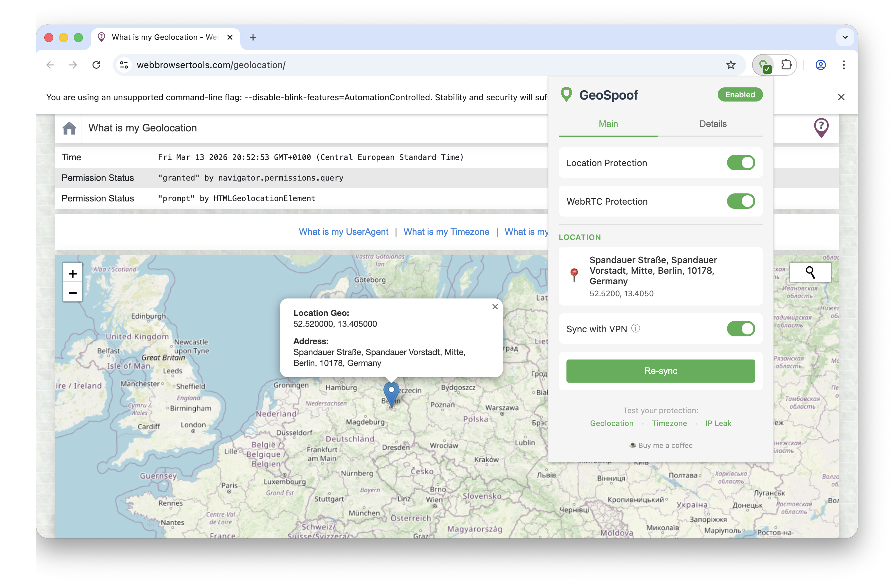

  

# GeoSpoof

**Your VPN changes your IP address. Your browser is still telling websites where you actually are.**

[Firefox Add-ons](https://addons.mozilla.org/en-US/firefox/addon/geo-spoof/) &nbsp;|&nbsp; [Chrome Web Store](https://chromewebstore.google.com/detail/geospoof/dgdbdodafgaeifgajaajohkjjgobcgje) &nbsp;|&nbsp; [Report Issues](https://github.com/anthonysgro/geospoof/issues) &nbsp;|&nbsp; [User Guide](docs/USER_GUIDE.md)

  

    
  

## Why GeoSpoof?

A VPN changes your IP, but your browser still leaks your real location through the Geolocation API, timezone offsets, `Intl.DateTimeFormat`, WebRTC, and more. Sites cross-reference these signals against your IP — when they don't match, you're flagged.

GeoSpoof overrides every one of those channels so your browser reports a consistent, chosen location instead of your real one. Set it to match your VPN, mismatch it on purpose, or pick anywhere in the world.

- **VPN Region Sync** — detects your VPN exit IP and sets your location to match. One click.
- **Manual control** — search for a city or enter coordinates directly.
- **Full signal alignment** — geolocation, timezone, Date APIs, Intl, Temporal, and WebRTC all report the same place.
- **Anti-fingerprinting** — overrides are disguised to pass native code checks used by real-world fingerprinting scripts.
- **Cross-browser** — Firefox, Chrome, Brave, Edge, and Safari. Single codebase, MV3.

> **Note:** Use of this tool may violate the Terms of Service of certain websites. Use responsibly.

### What This Does NOT Do

GeoSpoof is designed to work alongside a VPN, not replace one.

- Does NOT spoof your IP address (use a VPN for that)
- Does NOT change browser language or locale
- Does NOT bypass server-side detection (IP, payment info, account history)
- Does NOT track your browsing activity, collect telemetry, or store data on external servers. Some features (city search, VPN sync) call third-party APIs to function. See [External Services](#external-services) for exactly what's sent and to whom.
- Does NOT provide forensic-level anti-fingerprinting. Web Workers run in an isolated thread that extensions cannot inject into, meaning timezone can leak through that channel. Engine-level API tampering is also detectable by dedicated tools. For extreme threat models, use [Tor Browser](https://www.torproject.org/) or [Mullvad Browser](https://mullvad.net/browser) instead. GeoSpoof's goal is to present a plausible, consistent location identity — not to defeat forensic fingerprinting.

## Overridden APIs

When protection is enabled, GeoSpoof overrides browser APIs synchronously at `document_start` before any page JavaScript runs. Covered APIs include:

- **Geolocation** — `navigator.geolocation.getCurrentPosition/watchPosition`, `navigator.permissions.query`
- **Date & Timezone** — `Date` constructor, `Date.parse`, all `Date.prototype` getters and formatters, `getTimezoneOffset`
- **Intl** — `Intl.DateTimeFormat` constructor and `resolvedOptions`
- **Temporal** — `Temporal.Now.*` (feature-detected)
- **WebRTC** — via browser privacy API, no script injection needed
- **Anti-fingerprinting** — `Function.prototype.toString` returns `[native code]` for all overrides; iframes patched on insertion

For the full API reference, see [docs/API.md](docs/API.md).

## Installation

**Firefox:** https://addons.mozilla.org/firefox/addon/geo-spoof/

**Chrome / Brave / Edge:** https://chromewebstore.google.com/detail/geospoof/dgdbdodafgaeifgajaajohkjjgobcgje

**From GitHub Releases (Firefox self-hosted):**

Each release includes a self-hosted signed XPI alongside the AMO submission. The self-hosted XPI uses a 4-segment version (e.g., `1.18.0.42`) to avoid collisions with the AMO listing.

1. Go to the [Releases](https://github.com/anthonysgro/geospoof/releases) page
2. Download `geospoof-<version>-signed.xpi` from the latest release
3. In Firefox, open `about:addons`
4. Click the gear icon (⚙) and select **Install Add-on From File…**
5. Select the downloaded `.xpi` file

The signed XPI works on standard Firefox with no extra configuration. Once installed, Firefox automatically checks for and installs new versions via the self-hosted update manifest. If you later install from AMO, Firefox will auto-upgrade to it since AMO releases use a higher base version.

> **Note:** An unsigned `geospoof-<version>.xpi` is also included in each release for Firefox forks that don't support AMO signatures. Most users should use the signed version.

**From source:** See [CONTRIBUTING.md](CONTRIBUTING.md) for build instructions.

## Usage

1. Click the GeoSpoof icon in your toolbar
2. Search for a city, enter coordinates manually, or use "Sync with VPN" to auto-detect your VPN exit region
3. Enable "Location Protection" and "WebRTC Protection"
4. Refresh open tabs to apply

See [docs/USER_GUIDE.md](docs/USER_GUIDE.md) for details.

## External Services

| Service                                                            | When                           | What's sent                                                            | Source                                                                 |
| ------------------------------------------------------------------ | ------------------------------ | ---------------------------------------------------------------------- | ---------------------------------------------------------------------- |
| [Nominatim](https://nominatim.org/) (OpenStreetMap)                | City search, reverse geocoding | Search query or coordinates                                            | [GitHub](https://github.com/osm-search/Nominatim)                      |
| [browser-geo-tz](https://www.npmjs.com/package/browser-geo-tz) CDN | Timezone resolution            | HTTPS range requests for boundary data chunks (coordinates stay local) | [GitHub](https://github.com/kevmo314/browser-geo-tz)                   |
| [ipify](https://www.ipify.org/)                                    | VPN sync enabled               | HTTPS request to detect your public IP                                 | [GitHub](https://github.com/rdegges/ipify-api)                         |
| [GeoJS](https://www.geojs.io/)                                     | VPN sync enabled               | Your public IP (to geolocate VPN exit region)                          | [GitHub](https://github.com/jloh/geojs)                                |
| [FreeIPAPI](https://freeipapi.com/)                                | VPN sync fallback              | Your public IP (fallback geolocation service)                          | Closed source ([Privacy Policy](https://freeipapi.com/privacy-policy)) |
| [ReallyFreeGeoIP](https://reallyfreegeoip.org/)                    | VPN sync fallback              | Your public IP (fallback geolocation service)                          | [GitHub](https://github.com/reallyfreegeoip/reallyfreegeoip)           |
| [ipinfo.io](https://ipinfo.io/)                                    | VPN sync fallback              | Your public IP (fallback geolocation service)                          | Closed source ([Privacy Policy](https://ipinfo.io/privacy-policy))     |

> **VPN Sync privacy note:** When you enable "Sync with VPN," your public IP is sent to `api.ipify.org` and up to four geolocation services (`get.geojs.io`, `free.freeipapi.com`, `reallyfreegeoip.org`, `ipinfo.io`) in parallel over HTTPS to determine your VPN exit region. Your IP is never saved to disk — it's held only in memory and cleared when you disable VPN sync. See [PRIVACY_POLICY.md](PRIVACY_POLICY.md) for full details.

No data is sent to the extension developer. See [PRIVACY_POLICY.md](PRIVACY_POLICY.md).

## Development

See [CONTRIBUTING.md](CONTRIBUTING.md) for setup, scripts, testing, and the release pipeline.

## Legal

Using location spoofing may violate terms of service of streaming, financial, or e-commerce platforms. You are responsible for compliance. See [PRIVACY_POLICY.md](PRIVACY_POLICY.md) for full details.

## License

MIT — see [LICENSE](LICENSE).

## Links

- [User Guide](docs/USER_GUIDE.md)
- [API Documentation](docs/API.md)
- [How Browsers Track Location](docs/BACKGROUND.md)
- [Privacy Policy](PRIVACY_POLICY.md)
- [Contributing](CONTRIBUTING.md)
- [Report Issues](https://github.com/anthonysgro/geospoof/issues)
- [Buy me a coffee](https://buymeacoffee.com/sgro)

## Acknowledgments

- [Nominatim](https://nominatim.org/) for geocoding
- [browser-geo-tz](https://github.com/kevmo314/browser-geo-tz) for timezone boundary-data lookup
- [BrowserLeaks](https://browserleaks.com/) for testing tools
