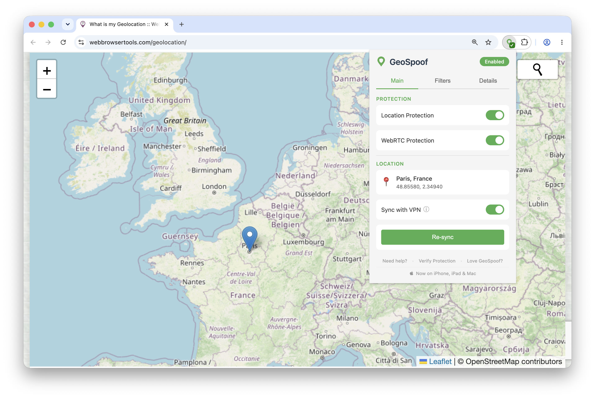

  

# GeoSpoof

**Your VPN changes your IP address. Your browser is still telling websites where you actually are.**

  

    
  

## Contents

- [Getting started](#getting-started) — [Install](#install) · [Usage](#usage)
- [Why GeoSpoof?](#why-geospoof) — [What it does NOT do](#what-this-does-not-do)
- [Overridden APIs](#overridden-apis)
- [External Services](#external-services)
- [Featured in](#featured-in)
- [Development](#development)

## Getting started

### Install

|                                                                                                                                         Browser                                                                                                                                         | Store                                                                                                                                                          | Works on                                                                                  |
| :-------------------------------------------------------------------------------------------------------------------------------------------------------------------------------------------------------------------------------------------------------------------------------------: | -------------------------------------------------------------------------------------------------------------------------------------------------------------- | ----------------------------------------------------------------------------------------- |
|                                                                           | [Firefox Add-ons](https://addons.mozilla.org/firefox/addon/geo-spoof/?utm_source=github&utm_medium=readme&utm_campaign=readme)                                 | Firefox 140+ on desktop and Android                                                       |
|                                              | [Chrome Web Store](https://chromewebstore.google.com/detail/geospoof/dgdbdodafgaeifgajaajohkjjgobcgje?utm_source=github&utm_medium=readme&utm_campaign=readme) | Chrome, Brave, Edge, Opera, and other Chromium browsers                                   |
|                                                                                                         | [App Store](https://apps.apple.com/app/apple-store/id6765719745?pt=128299974&ct=github&mt=8)                                                                   | Safari on iOS, iPadOS, and macOS                                                          |
| [<picture><source media="(prefers-color-scheme: dark)" srcset="assets/store-listings/github/github-dark.svg"></picture>](https://github.com/anthonysgro/geospoof/releases) | [GitHub Releases](https://github.com/anthonysgro/geospoof/releases)                                                                                            | Firefox self-hosted signed XPI — [setup below](#from-github-releases-firefox-self-hosted) |

<strong>Safari setup</strong> — enabling after install

 

After installing on Safari, tap the puzzle piece icon (or go to Safari Settings → Extensions) and enable GeoSpoof for the sites you want to protect. On iOS/iPadOS, you can also enable it per-site from the **AA** menu in the address bar.

<strong>Other install paths</strong> — self-hosted XPI, from source

#### From GitHub Releases (Firefox self-hosted)

Each release includes a self-hosted signed XPI alongside the AMO submission. The self-hosted XPI uses a 4-segment version (e.g., `1.18.0.42`) to avoid collisions with the AMO listing.

1. Go to the [Releases](https://github.com/anthonysgro/geospoof/releases) page
2. Download `geospoof-firefox-v<version>-signed.xpi` from the latest release
3. In Firefox, open `about:addons`
4. Click the gear icon (⚙) and select **Install Add-on From File…**
5. Select the downloaded `.xpi` file

The signed XPI works on standard Firefox with no extra configuration. Once installed, Firefox automatically checks for and installs new versions via the self-hosted update manifest. If you later install from AMO, Firefox will auto-upgrade to it since AMO releases use a higher base version.

> **Note:** An unsigned `geospoof-firefox-v<version>-unsigned.xpi` is also included in each release for Firefox forks that don't support AMO signatures. Most users should use the signed version.

#### From source

See [CONTRIBUTING.md](CONTRIBUTING.md) for build instructions.

### Usage

1. Click the GeoSpoof icon in your toolbar
2. Search for a city, enter coordinates manually, or use "Sync with VPN" to auto-detect your VPN exit region
3. Enable "Location Protection", "WebRTC Protection", and "Sync with VPN" features
4. Refresh open tabs to apply
5. Confirm it's working at [geospoof.com/verify](https://geospoof.com/verify)

See [docs/USER_GUIDE.md](docs/USER_GUIDE.md) for details.

## Why GeoSpoof?

A VPN changes your IP, but your browser still leaks your real location through the Geolocation API, timezone offsets, `Intl.DateTimeFormat`, WebRTC, and more. Sites cross-reference these signals against your IP — when they don't match, you're flagged.

GeoSpoof overrides every one of those channels so your browser reports a consistent, chosen location instead of your real one. Set it to match your VPN, mismatch it on purpose, or pick anywhere in the world.

- **VPN Region Sync** — detects your VPN exit IP and sets your location to match. One click, and it re-syncs automatically as you switch exit servers.
- **Manual control** — search for a city or enter coordinates directly.
- **Full signal alignment** — geolocation, timezone, Date APIs, Intl, Temporal, and WebRTC all report the same place.
- **Anti-fingerprinting** — overrides are disguised to pass native code checks used by real-world fingerprinting scripts.
- **Cross-browser** — Firefox, Chrome, Brave, Edge, and Safari. Single codebase, MV3.

> **Note:** Use of this tool may violate the Terms of Service of certain websites. Use responsibly.

### What This Does NOT Do

GeoSpoof is designed to work alongside a VPN, not replace one.

- Does NOT spoof your IP address (use a VPN for that)
- Does NOT change browser language or locale
- Does NOT bypass server-side detection (IP, payment info, account history)
- Does NOT track your browsing activity, collect telemetry, or store data on external servers. Some features (city search, VPN sync) call third-party APIs to function. See the [Privacy Policy](PRIVACY_POLICY.md) for exactly what's sent and to whom.
- Does NOT provide forensic-level anti-fingerprinting. Engine-level API tampering is also detectable by dedicated tools. For extreme threat models, use [Tor Browser](https://www.torproject.org/) or [Mullvad Browser](https://mullvad.net/browser) instead.

## Overridden APIs

When protection is enabled, GeoSpoof overrides browser APIs synchronously at `document_start` before any page JavaScript runs. Covered APIs include:

- **Geolocation** — `navigator.geolocation.getCurrentPosition/watchPosition`, `navigator.permissions.query`
- **Date & Timezone** — `Date` constructor, `Date.parse`, all `Date.prototype` getters and formatters, `getTimezoneOffset`
- **Intl** — `Intl.DateTimeFormat` constructor and `resolvedOptions`
- **Temporal** — `Temporal.Now.*` (feature-detected)
- **XSLT / EXSLT** — `XSLTProcessor.prototype.transformToFragment/transformToDocument` rewrite EXSLT `date:date-time()` output (Firefox, where available)
- **Workers** — `Worker`, `SharedWorker`, and `navigator.serviceWorker.register` wrapped to propagate the spoofed timezone into worker scopes (URL-based worker coverage is the Firefox `webRequest.filterResponseData` path; inline/blob workers are covered on every engine)
- **WebRTC** — via browser privacy API, no script injection needed
- **Anti-fingerprinting** — `Function.prototype.toString` returns `[native code]` for all overrides; iframes patched on insertion
- **Engine-level Spoofing** (Chrome/Chromium, opt-in) — an optional mode that drives the timezone override through the Chrome DevTools Protocol (`chrome.debugger` → `Emulation.setTimezoneOverride`) instead of page-world injection. It covers background/module/service workers and applies before a page's first script, closing the worker and cold-start timezone leaks the content-script path can't reach on Chromium MV3. Off by default; while on, Chrome shows a "started debugging this browser" notice. Geolocation stays on the injected path.

For the full API reference, see [docs/API.md](docs/API.md). For the VPN sync and auto-resync architecture, see [docs/VPN_SYNC.md](docs/VPN_SYNC.md).

## External Services

GeoSpoof runs no backend application and sends no data to the developer for collection or analytics. Some features — city search and the optional "Sync with VPN" — make requests directly from your device to third-party services. Timezone resolution downloads boundary data from the developer's own CDN (`cdn.geospoof.com`, hosted on AWS), which transmits your IP as part of that request. The developer does **not** use these requests for analytics, tracking, profiling, advertising, or user accounts, and stores no personal data from them. Exactly what is sent, when, and to whom (for both the Safari extension and the companion apps) is documented in the [Privacy Policy](PRIVACY_POLICY.md).

## Featured in

- [Privacy Guides community forum](https://discuss.privacyguides.net/t/geospoof-a-firefox-add-on-for-convenient-geolocation-privacy/36159) — "GeoSpoof: a Firefox add-on for convenient geolocation privacy"
- [Korben](https://korben.info/geospoof-vpn-navigateur-localisation.html) — "GeoSpoof - Le VPN cache votre IP mais le navigateur vous trahit" (FR)

## Development

See [CONTRIBUTING.md](CONTRIBUTING.md) for setup, scripts, testing, and the release pipeline.

## Legal

Using location spoofing may violate terms of service of streaming, financial, or e-commerce platforms. You are responsible for compliance. See [PRIVACY_POLICY.md](PRIVACY_POLICY.md) for full details.

## License

The GeoSpoof browser extension and everything in this repository is **open source (MIT)** — see [LICENSE](LICENSE). Use, modify, and redistribute freely, including commercially.

The native GeoSpoof GPS desktop core (the Rust/Swift device product) is developed separately as a closed-source product and is not part of this repository.

**Trademarks:** The MIT license covers the source code only, not the brand. **GeoSpoof™ is a trademark of Anthony Sgro.** You're free to use and fork the code under MIT, but the GeoSpoof name and logo aren't licensed with it — please don't brand a fork or derivative product as "GeoSpoof" in a way that could confuse users about its source.

## Links

- [Website — geospoof.com](https://geospoof.com/?utm_source=github&utm_medium=readme)
- [Verify your protection — geospoof.com/verify](https://geospoof.com/verify?utm_source=github&utm_medium=readme)
- [Community — r/GeoSpoof](https://www.reddit.com/r/geospoof)
- [User Guide](docs/USER_GUIDE.md)
- [API Documentation](docs/API.md)
- [VPN Sync & Auto-Resync](docs/VPN_SYNC.md)
- [How Browsers Track Location](docs/BACKGROUND.md)
- [Privacy Policy](PRIVACY_POLICY.md)
- [Contributing](CONTRIBUTING.md)
- [Report Issues](https://github.com/anthonysgro/geospoof/issues)
- [Buy me a coffee](https://buymeacoffee.com/sgro)

## Star History

<a href="https://www.star-history.com/?repos=anthonysgro%2Fgeospoof&type=date&legend=top-left">
  <picture>
    <source media="(prefers-color-scheme: dark)" srcset="https://api.star-history.com/chart?repos=anthonysgro/geospoof&type=date&theme=dark&legend=top-left" />
    <source media="(prefers-color-scheme: light)" srcset="https://api.star-history.com/chart?repos=anthonysgro/geospoof&type=date&legend=top-left" />
    
  </picture>
</a>

## Acknowledgments

- [Nominatim](https://nominatim.org/) for geocoding
- [browser-geo-tz](https://github.com/kevmo314/browser-geo-tz) for timezone boundary-data lookup
- [BrowserLeaks](https://browserleaks.com/) for testing tools
- [arkenfox TZP](https://arkenfox.github.io/TZP/tzp.html) for timezone/geolocation fingerprint testing
- [CreepJS](https://abrahamjuliot.github.io/creepjs/) for fingerprint testing
- [webbrowsertools](https://webbrowsertools.com/) for testing tools

### Contributors

Thanks to everyone who has contributed to GeoSpoof.

