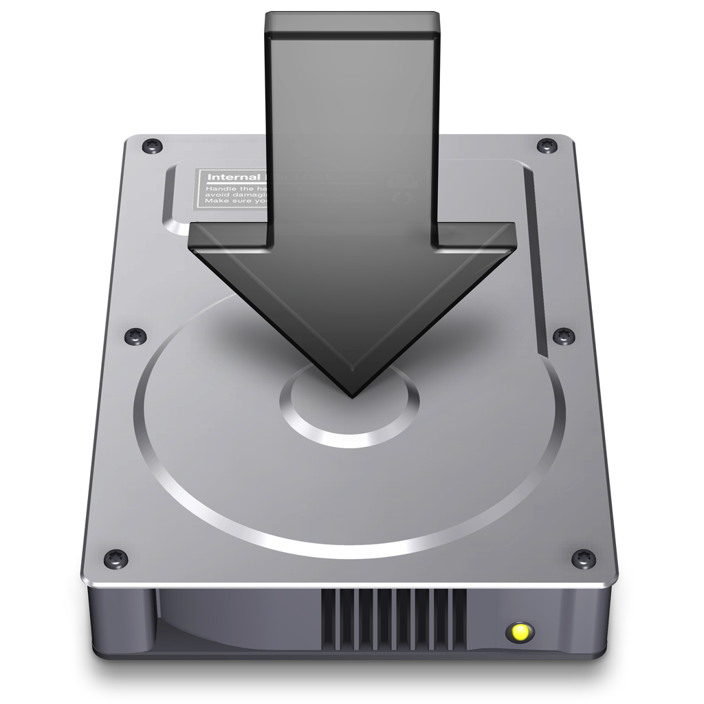

  

# GeoSpoof

**Your VPN changes your IP address. Your browser is still telling websites where you actually are.**

  

    
  

## Getting started

### Install

|                                                                                     Browser                                                                                     | Store                                                                                                  | Works on                                                                                                             |
| :-----------------------------------------------------------------------------------------------------------------------------------------------------------------------------: | ------------------------------------------------------------------------------------------------------ | -------------------------------------------------------------------------------------------------------------------- |
|                               | [Firefox Add-ons](https://addons.mozilla.org/firefox/addon/geo-spoof/)                                 | Firefox 140+ on desktop and Android                                                                                  |
|  | [Chrome Web Store](https://chromewebstore.google.com/detail/geospoof/dgdbdodafgaeifgajaajohkjjgobcgje) | Chrome, Brave, Edge, Opera, and other Chromium browsers                                                              |
|                            | [App Store](https://apps.apple.com/app/geospoof/id6765719745)                                          | Safari on iOS, iPadOS, and macOS                                                                                     |
|                      | [GitHub Releases (macOS DMG)](https://github.com/anthonysgro/geospoof/releases/latest)                 | Safari on macOS — direct download, no Apple ID required — [setup below](#from-github-releases-macos-direct-download) |
|                          | [GitHub Releases](https://github.com/anthonysgro/geospoof/releases)                                    | Firefox self-hosted signed XPI — [setup below](#from-github-releases-firefox-self-hosted)                            |

<strong>Safari setup</strong> — enabling after install

 

After installing on Safari, tap the puzzle piece icon (or go to Safari Settings → Extensions) and enable GeoSpoof for the sites you want to protect. On iOS/iPadOS, you can also enable it per-site from the **AA** menu in the address bar.

<strong>Other install paths</strong> — macOS DMG, self-hosted XPI, from source

#### From GitHub Releases (macOS direct download)

If you'd rather not sign in to the App Store, you can install GeoSpoof from a notarized DMG distributed through GitHub Releases. Same code as the App Store build — signed with our Developer ID and notarized by Apple, so Gatekeeper accepts it on first launch.

1. Go to the [Releases](https://github.com/anthonysgro/geospoof/releases) page
2. Download `geospoof-macos-v<version>.dmg` from the latest release
3. Double-click the DMG and drag **GeoSpoof.app** to your **Applications** folder
4. Launch GeoSpoof once from `/Applications` (the first launch enables the Safari extension)
5. Open Safari → Settings → Extensions, enable **GeoSpoof**, and grant the website permissions you want

> **First launch:** macOS will ask "GeoSpoof was downloaded from the internet — are you sure you want to open it?" the first time. Click **Open** — this only appears once. The wrapper app's window just confirms the extension is active; you'll spend the rest of your time in Safari.

> **Updates:** the direct-download build does not auto-update. To upgrade, re-download the latest DMG and replace `GeoSpoof.app` in `/Applications`. Your settings persist across upgrades. If you'd prefer auto-updates, install from the [App Store](https://apps.apple.com/app/geospoof/id6765719745) instead.

> **Requirements:** macOS 11+ on Apple Silicon or Intel. iOS / iPadOS users still need the [App Store](https://apps.apple.com/app/geospoof/id6765719745) build — Apple does not allow sideloading Safari extensions on those platforms.

#### From GitHub Releases (Firefox self-hosted)

Each release includes a self-hosted signed XPI alongside the AMO submission. The self-hosted XPI uses a 4-segment version (e.g., `1.18.0.42`) to avoid collisions with the AMO listing.

1. Go to the [Releases](https://github.com/anthonysgro/geospoof/releases) page
2. Download `geospoof-firefox-v<version>-signed.xpi` from the latest release
3. In Firefox, open `about:addons`
4. Click the gear icon (⚙) and select **Install Add-on From File…**
5. Select the downloaded `.xpi` file

The signed XPI works on standard Firefox with no extra configuration. Once installed, Firefox automatically checks for and installs new versions via the self-hosted update manifest. If you later install from AMO, Firefox will auto-upgrade to it since AMO releases use a higher base version.

> **Note:** An unsigned `geospoof-firefox-v<version>-unsigned.xpi` is also included in each release for Firefox forks that don't support AMO signatures. Most users should use the signed version.

#### From source

See [CONTRIBUTING.md](CONTRIBUTING.md) for build instructions.

### Usage

1. Click the GeoSpoof icon in your toolbar
2. Search for a city, enter coordinates manually, or use "Sync with VPN" to auto-detect your VPN exit region
3. Enable "Location Protection" and "WebRTC Protection"
4. Refresh open tabs to apply
5. Confirm it's working at [geospoof.com/test](https://geospoof.com/test) — a live dashboard that shows every signal GeoSpoof overrides, running 110 tests against your browser

See [docs/USER_GUIDE.md](docs/USER_GUIDE.md) for details.

## Why GeoSpoof?

A VPN changes your IP, but your browser still leaks your real location through the Geolocation API, timezone offsets, `Intl.DateTimeFormat`, WebRTC, and more. Sites cross-reference these signals against your IP — when they don't match, you're flagged.

GeoSpoof overrides every one of those channels so your browser reports a consistent, chosen location instead of your real one. Set it to match your VPN, mismatch it on purpose, or pick anywhere in the world.

- **VPN Region Sync** — detects your VPN exit IP and sets your location to match. One click.
- **Manual control** — search for a city or enter coordinates directly.
- **Full signal alignment** — geolocation, timezone, Date APIs, Intl, Temporal, and WebRTC all report the same place.
- **Anti-fingerprinting** — overrides are disguised to pass native code checks used by real-world fingerprinting scripts.
- **Cross-browser** — Firefox, Chrome, Brave, Edge, and Safari. Single codebase, MV3.

> **Note:** Use of this tool may violate the Terms of Service of certain websites. Use responsibly.

### What This Does NOT Do

GeoSpoof is designed to work alongside a VPN, not replace one.

- Does NOT spoof your IP address (use a VPN for that)
- Does NOT change browser language or locale
- Does NOT bypass server-side detection (IP, payment info, account history)
- Does NOT track your browsing activity, collect telemetry, or store data on external servers. Some features (city search, VPN sync) call third-party APIs to function. See the [Privacy Policy](PRIVACY_POLICY.md) for exactly what's sent and to whom.
- Does NOT provide forensic-level anti-fingerprinting. Engine-level API tampering is also detectable by dedicated tools. For extreme threat models, use [Tor Browser](https://www.torproject.org/) or [Mullvad Browser](https://mullvad.net/browser) instead.

## Overridden APIs

When protection is enabled, GeoSpoof overrides browser APIs synchronously at `document_start` before any page JavaScript runs. Covered APIs include:

- **Geolocation** — `navigator.geolocation.getCurrentPosition/watchPosition`, `navigator.permissions.query`
- **Date & Timezone** — `Date` constructor, `Date.parse`, all `Date.prototype` getters and formatters, `getTimezoneOffset`
- **Intl** — `Intl.DateTimeFormat` constructor and `resolvedOptions`
- **Temporal** — `Temporal.Now.*` (feature-detected)
- **WebRTC** — via browser privacy API, no script injection needed
- **Anti-fingerprinting** — `Function.prototype.toString` returns `[native code]` for all overrides; iframes patched on insertion

For the full API reference, see [docs/API.md](docs/API.md).

## External Services

GeoSpoof sends nothing to the developer and runs no backend. Some features — city search, timezone resolution, and the optional "Sync with VPN" — make requests directly from your device to third-party services. Exactly what is sent, when, and to whom (for both the Safari extension and the companion apps) is documented in the [Privacy Policy](PRIVACY_POLICY.md).

## Development

See [CONTRIBUTING.md](CONTRIBUTING.md) for setup, scripts, testing, and the release pipeline.

## Legal

Using location spoofing may violate terms of service of streaming, financial, or e-commerce platforms. You are responsible for compliance. See [PRIVACY_POLICY.md](PRIVACY_POLICY.md) for full details.

## License

MIT — see [LICENSE](LICENSE).

## Links

- [Website — geospoof.com](https://geospoof.com)
- [Verify your protection — geospoof.com/test](https://geospoof.com/test)
- [User Guide](docs/USER_GUIDE.md)
- [API Documentation](docs/API.md)
- [How Browsers Track Location](docs/BACKGROUND.md)
- [Privacy Policy](PRIVACY_POLICY.md)
- [Contributing](CONTRIBUTING.md)
- [Report Issues](https://github.com/anthonysgro/geospoof/issues)
- [Buy me a coffee](https://buymeacoffee.com/sgro)

## Acknowledgments

- [Nominatim](https://nominatim.org/) for geocoding
- [browser-geo-tz](https://github.com/kevmo314/browser-geo-tz) for timezone boundary-data lookup
- [BrowserLeaks](https://browserleaks.com/) for testing tools
