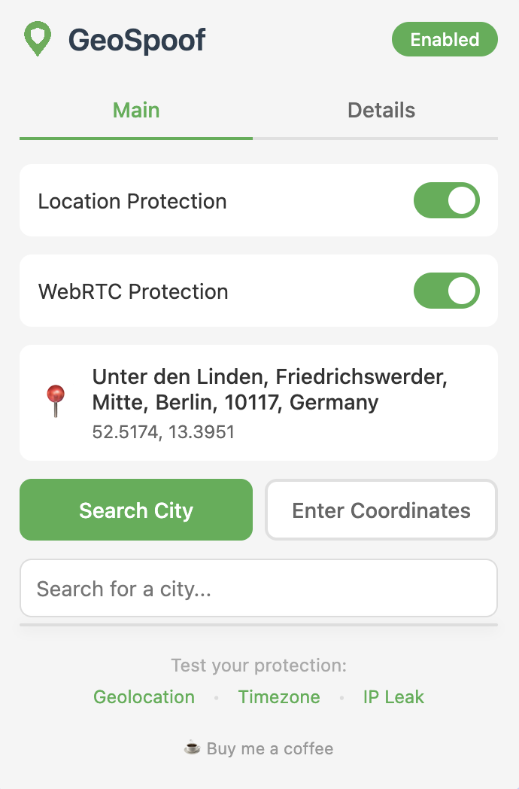
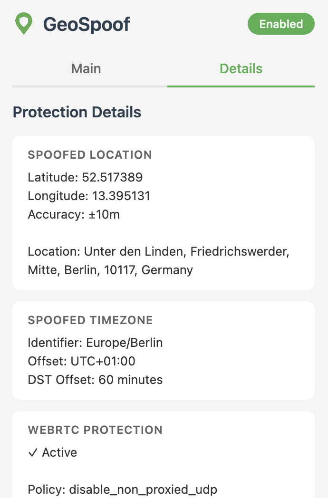
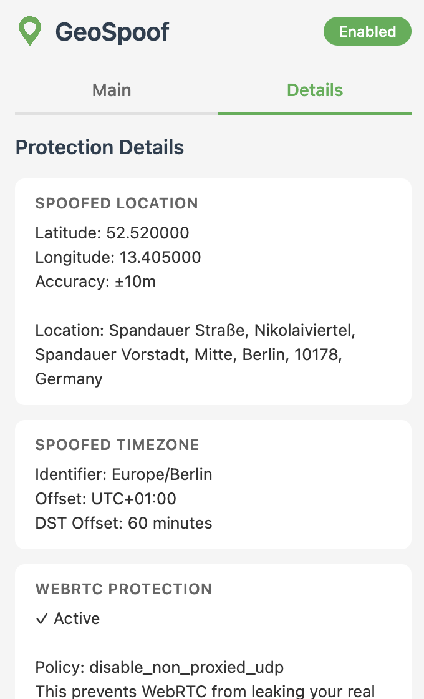

# GeoSpoof

Your VPN changes your IP address. Your browser is still telling websites where you actually are.

Install: [Firefox Add-ons Store](https://addons.mozilla.org/en-US/firefox/addon/geo-spoof/)

<p>
  
    
  
</p>

## Why GeoSpoof?

### The Problem

Your browser leaks your location through multiple channels: the Geolocation API, timezone offsets, `Intl.DateTimeFormat`, and WebRTC. You get almost no control over it. A VPN changes your IP, but these signals still point right back to where you're sitting. Sites cross-reference them against your IP, and when they don't match, you're flagged.

Blocking geolocation requests is your right, but some sites treat it as evasion and restrict access or flag your account. And if you allow it, your real coordinates go straight to the site. You're stuck choosing between access and privacy.

### The Fix

GeoSpoof gives you full control over what your browser reports. Set your location to match your VPN, mismatch it on purpose for extra obfuscation, or pick somewhere entirely different. GPS coordinates, timezone, `Intl` locale data, and WebRTC all stay in sync with whatever you choose.

- **VPN Region Sync**: Detects your VPN exit IP and sets your spoofed location to match. One click, no manual coordinates.
- **Manual Coordinates**: Search for a city or enter any latitude/longitude directly. Your location doesn't have to match your VPN.
- **Full Signal Alignment**: All location signals report the same place, so sites see one consistent identity instead of mismatched data.
- **Bypass Hard Gates**: Sites that refuse to load without geolocation permission get a clean, consistent response.
- **Dev & QA**: Test geofenced apps, localized content, or location-aware UIs without leaving your desk.

> **Note:** Use of this tool may violate the Terms of Service of certain websites. This is purely in the interest of legitimate privacy use and development purposes. Use responsibly.

### What This Does NOT Do

GeoSpoof is designed to work alongside a VPN, not replace one.

- Does NOT spoof your IP address (use a VPN for that)
- Does NOT change browser language or locale
- Does NOT bypass server-side detection (IP, payment info, account history)
- Does NOT track your browsing activity, collect telemetry, store data on external servers, or share data with third parties

## Overridden APIs

When protection is enabled, GeoSpoof overrides the following browser APIs on every page. All overrides are injected synchronously at `document_start` before any page JavaScript runs.

### Geolocation

| API                                                    | Behavior                          |
| ------------------------------------------------------ | --------------------------------- |
| `navigator.geolocation.getCurrentPosition()`           | Returns your spoofed coordinates  |
| `navigator.geolocation.watchPosition()`                | Returns your spoofed coordinates  |
| `navigator.geolocation.clearWatch()`                   | Clears spoofed watch callbacks    |
| `navigator.permissions.query({ name: "geolocation" })` | Reports permission as `"granted"` |

### Timezone

| API                                               | Behavior                                                                       |
| ------------------------------------------------- | ------------------------------------------------------------------------------ |
| `Date.prototype.getTimezoneOffset()`              | Returns the correct offset for the spoofed timezone, including DST transitions |
| `Intl.DateTimeFormat()` constructor               | Injects the spoofed IANA timezone into all format options                      |
| `Intl.DateTimeFormat.prototype.resolvedOptions()` | Returns the spoofed timezone identifier                                        |
| `Date.prototype.toString()`                       | Formats using the spoofed timezone                                             |
| `Date.prototype.toTimeString()`                   | Formats using the spoofed timezone                                             |
| `Date.prototype.toLocaleString()`                 | Formats using the spoofed timezone                                             |
| `Date.prototype.toLocaleDateString()`             | Formats using the spoofed timezone                                             |
| `Date.prototype.toLocaleTimeString()`             | Formats using the spoofed timezone                                             |

### WebRTC

| API                                      | Behavior                                                                                       |
| ---------------------------------------- | ---------------------------------------------------------------------------------------------- |
| `privacy.network.webRTCIPHandlingPolicy` | Configured via Firefox's built-in privacy API to prevent IP leaks — no script injection needed |

## Installation

**From Firefox Add-ons:** https://addons.mozilla.org/en-US/firefox/addon/geo-spoof

**From source:**

```bash
git clone https://github.com/anthonysgro/geospoof.git
cd geospoof
npm install
cp .env.example .env
npm run build:dev
npm start              # Launches Firefox with the extension loaded
```

Or load `dist/manifest.json` manually as a temporary add-on via `about:debugging`.

## Usage

1. Click the GeoSpoof icon in your toolbar
2. Search for a city, enter coordinates manually, or use "Sync with VPN" to auto-detect your VPN exit region
3. Enable "Location Protection" and "WebRTC Protection"
4. Refresh open tabs to apply

See [USER_GUIDE.md](USER_GUIDE.md) for details.

## External Services

| Service                                                            | When                           | What's sent                                                            | Source                                                                 |
| ------------------------------------------------------------------ | ------------------------------ | ---------------------------------------------------------------------- | ---------------------------------------------------------------------- |
| [Nominatim](https://nominatim.org/) (OpenStreetMap)                | City search, reverse geocoding | Search query or coordinates                                            | [GitHub](https://github.com/osm-search/Nominatim)                      |
| [browser-geo-tz](https://www.npmjs.com/package/browser-geo-tz) CDN | Timezone resolution            | HTTPS range requests for boundary data chunks (coordinates stay local) | [GitHub](https://github.com/kevmo314/browser-geo-tz)                   |
| [ipify](https://www.ipify.org/)                                    | VPN sync enabled               | HTTPS request to detect your public IP                                 | [GitHub](https://github.com/rdegges/ipify-api)                         |
| [FreeIPAPI](https://freeipapi.com/)                                | VPN sync enabled               | Your public IP (to geolocate VPN exit region)                          | Closed source ([Privacy Policy](https://freeipapi.com/privacy-policy)) |

> **VPN Sync privacy note:** When you enable "Sync with VPN," your public IP is sent to `api.ipify.org` and `freeipapi.com` over HTTPS to determine your VPN exit region. Your IP is never saved to disk — it's held only in memory and cleared when you disable VPN sync. See [PRIVACY_POLICY.md](PRIVACY_POLICY.md) for full details.

No data is sent to the extension developer. See [PRIVACY_POLICY.md](PRIVACY_POLICY.md).

## Development

**Requirements:** Node.js 18+, npm 9+, Firefox 115+

### Quick Start

```bash
git clone https://github.com/anthonysgro/geospoof.git
cd geospoof
npm install
cp .env.example .env
```

### Day-to-Day Development

Open two terminals:

```bash
# Terminal 1 — watches your source files and rebuilds on every save
npm run dev

# Terminal 2 — launches Firefox with the extension loaded, auto-reloads on rebuild
npm start
```

That's it. Edit code, save, Firefox reloads. If something looks wrong, check the browser console (`about:debugging` → Inspect for background, F12 for content scripts).

### Scripts Reference

| Command                  | What it does                                                       |
| ------------------------ | ------------------------------------------------------------------ |
| `npm run dev`            | Watch mode — Vite rebuilds `dist/` on every file change            |
| `npm start`              | Launch Firefox with the extension loaded from `dist/`              |
| `npm run build:dev`      | One-time dev build (source maps, console logs)                     |
| `npm run build:prod`     | One-time production build (minified, no logs)                      |
| `npm test`               | Run all tests                                                      |
| `npm run lint:ext`       | Lint the extension manifest and files                              |
| `npm run validate`       | Type-check + lint + format check + tests (run before PRs)          |
| `npm run package`        | Production build + zip for AMO submission                          |
| `npm run package:source` | Zip source code for AMO review (excludes node_modules, dist, etc.) |
| `npm run start:android`  | Launch on Firefox for Android (USB, auto-detects device)           |

### Testing on Android

Requires `adb` (`brew install android-platform-tools`) and a USB-connected Android device with Firefox installed.

1. Enable Developer Options on your device (Settings → About Phone → tap Build Number 7 times)
2. Enable USB Debugging (Settings → Developer Options → USB Debugging)
3. In Firefox for Android: Settings → Remote debugging via USB → On
4. Connect via USB and run:

```bash
npm run build:dev
npm run start:android
```

The script auto-detects the first connected device via `adb`. To target a specific device, pass its ID manually:

```bash
npm run start:android -- <device-id>
```

You can find device IDs with `adb devices`.

### Building for Mozilla Review

```bash
npm install
cp .env.example .env
npm run package
```

This runs a production build and packages the extension into `web-ext-artifacts/geospoof-<version>.zip` for AMO submission. TypeScript source in `src/` is compiled via Vite + esbuild. No hand-minification or obfuscation.

### Project Structure

```
src/
├── background/   # Settings, geocoding, timezone resolution
├── content/      # Content + injected scripts (API overrides)
├── popup/        # Extension popup UI
└── shared/       # Shared types and utilities
tests/
├── unit/         # Unit tests
├── integration/  # Integration tests
└── property/     # Property-based tests (fast-check)
```

## Legal

Using location spoofing may violate terms of service of streaming, financial, or e-commerce platforms. You are responsible for compliance. See [PRIVACY_POLICY.md](PRIVACY_POLICY.md) for full details.

## License

MIT — see [LICENSE](LICENSE).

## Links

- [User Guide](USER_GUIDE.md)
- [Privacy Policy](PRIVACY_POLICY.md)
- [Report Issues](https://github.com/anthonysgro/geospoof/issues)
- [Buy me a coffee](https://buymeacoffee.com/sgro)

## Acknowledgments

- [Nominatim](https://nominatim.org/) for geocoding
- [browser-geo-tz](https://github.com/kevmo314/browser-geo-tz) for timezone boundary-data lookup
- [BrowserLeaks](https://browserleaks.com/) for testing tools
