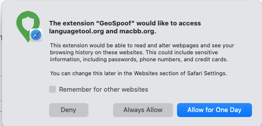

# GeoSpoof User Guide

Quick guide to using GeoSpoof to spoof your browser's geolocation and protect against IP leaks.

## Quick Start

1. **Set Your Location**
   - Search for a city, enter coordinates manually, or use "Sync with VPN" to auto-detect your VPN exit region
   - Click a search result to set location

2. **Enable Protection**
   - Toggle "Location Protection" ON
   - Toggle "WebRTC Protection" ON (recommended)

3. **Verify It Works**
   - Click test links in the extension (Geolocation, Timezone, IP Leak)
   - Refresh any open tabs to apply protection

## Features

### Location Spoofing

Overrides your browser's geolocation to show a fake location. Works on any website that requests your location.

### VPN Sync

Detects your current public IP and automatically sets your spoofed location to match your VPN exit region. Enable the "Sync with VPN" toggle, then tap "Sync Now".

> Note: VPN sync uses third-party IP geolocation services. If your VPN's threat protection blocks IP lookup domains, sync may fail — disable it temporarily if needed.

### WebRTC Protection

Prevents websites from detecting your real IP address through WebRTC, even when using a VPN.

### Timezone Spoofing

Automatically adjusts your browser's timezone to match your spoofed location for consistency.

### Site Filters

Control which sites GeoSpoof spoofs on. In the **Filters** tab, choose **All** (every site), **Allowlist** (only listed sites), or **Denylist** (every site except listed ones), then add patterns like `example.com`, `*.ru`, `localhost:3000`, or `site.com/app/*`. See the full pattern language — wildcards, ports, paths, and the rules to watch for — in the [Site Filters reference](SITE_FILTERS.md).

## How to Use

### Setting a Location

**Option 1: Search for a City**

1. Type a city name in the search box
2. Click a result from the dropdown
3. Wait for "Setting location..." to complete

**Option 2: Enter Coordinates**

1. Click "Enter Coordinates" tab
2. Enter latitude (-90 to 90) and longitude (-180 to 180)
3. Click "Set Location"

**Option 3: Sync with VPN**

1. Enable the "Sync with VPN" toggle
2. Click "Sync Now"
3. Your location will be set to match your VPN exit region

### Enabling Protection

**Location Protection**: Spoofs your geolocation API
**WebRTC Protection**: Prevents IP leaks through WebRTC

Both toggles work independently - you can enable one or both.

### Checking Status

**Badge Icon**:

- Green ✓ = Protection active
- Orange ! = Page needs refresh
- Gray (empty) = Protection disabled

**Details Tab**: Click "Details" to see exactly what's being spoofed (coordinates, timezone, APIs).

## Testing Your Protection

Use the built-in test links at the bottom of the extension:

- **Geolocation**: Verify your spoofed location coordinates
- **Timezone**: Check your spoofed timezone and date/time formatting
- **IP Leak**: Check for WebRTC IP leaks

## Important Notes

⚠️ **Refresh Required**: After enabling protection or changing location, refresh any open tabs for changes to take effect.

⚠️ **VPN Recommended**: This extension spoofs browser data only. For full privacy, use a VPN that matches your spoofed location.

⚠️ **Language/Locale Spoofing Is Opt-In**: By default GeoSpoof leaves your language alone, so a site can still notice that your browser reports `en-US` while your location says Paris. **Reported Language** closes that gap — turn it on in **Settings (the ⚙ gear in the popup header) → Reported Language** and pick either "Match my location" or a specific language. It moves `navigator.language`, every `Intl` format, and the `Accept-Language` header together, so they can't contradict each other.

It stays off unless you turn it on, because it visibly changes browsing: many sites will switch language outright, and the language you pick is sent with every request. Free on Firefox and Chrome; part of GeoSpoof Pro on Safari. This is separate from the **Language** setting, which only changes GeoSpoof's own interface and is never sent to websites. See [Reported Language](../README.md#reported-language-opt-in) for the full list of what it covers and what it can't.

⚠️ **Terms of Service**: Using location spoofing may violate the terms of service of some websites, particularly streaming services. Use responsibly and at your own risk.

## Languages

GeoSpoof is available in 12 languages: English, German, Spanish, French, Indonesian, Japanese, Dutch, Portuguese (Brazil), Russian, Swedish, Vietnamese, and Simplified Chinese.

Both the browser extension popup and the Safari app for iPhone, iPad, and Mac are translated. Everything except English is machine-translated and awaiting review by native speakers, so you may hit the occasional awkward phrase — corrections are very welcome, either as a GitHub issue or through TestFlight feedback.

**To change the language of the Safari app**, use the system setting rather than anything inside GeoSpoof:

- **iPhone / iPad** — Settings › Apps › GeoSpoof › Language
- **Mac** — System Settings › General › Language & Region › Applications, then add GeoSpoof and pick a language

There is deliberately no language picker inside the app. iOS and macOS already provide a per-app one, and using the system setting means GeoSpoof behaves like every other app on your device.

**To change the language of the extension popup**, use the picker in the popup's Settings view (the ⚙ gear in the popup header). Browsers don't offer a per-extension language setting, which is why the popup has its own.

Two things are worth keeping separate:

- **The app's language** is the one described above — what _you_ read.
- **Reported Language** is a different feature entirely. It changes the language _websites_ think you speak, to match a spoofed location. Turning it on does not change GeoSpoof's own language, and changing GeoSpoof's language does not change what websites see.

## Safari Permissions FAQ

When you enable GeoSpoof in Safari, you'll see a prompt warning that the extension can "read and alter webpages" and "see your browsing history," possibly including "passwords, phone numbers, and credit cards." This is alarming the first time you see it. Here's what's actually going on.

  

**Why does Safari say GeoSpoof can read and alter webpages?**
Because GeoSpoof runs on every website to override the location, timezone, and date APIs before each page loads. Safari shows this same standard warning for _any_ extension that works across all sites — ad blockers, password managers, dark-mode tools. The websites Safari names in the prompt are just the tabs you have open right now; GeoSpoof has no special interest in them.

**Does GeoSpoof actually read my pages, passwords, or browsing history?**
No. GeoSpoof never reads form fields, passwords, page text, or your history, and it never sends any of that anywhere. Its script only replaces the values returned by the Geolocation, `Date`, `Intl`, and Temporal APIs. It's open source, so you can verify this: https://github.com/anthonysgro/geospoof

**Does it send any data to the developer?**
No. The only outbound requests are the optional city-search and VPN-sync lookups, and only when you actively use those features. See [PRIVACY_POLICY.md](../PRIVACY_POLICY.md) for the full breakdown.

**Which permission option should I choose?**

- **Allow for One Day** — best for trying it out; access expires automatically.
- **Always Allow on Every Website** — most convenient for location protection everywhere.
- **Allow on specific websites** — grant per-site if you only want spoofing on certain sites.
- **Deny** — GeoSpoof won't run on that site and can't spoof your location there.

**How do I restrict or revoke access later?**
Open **Safari → Settings → Extensions → GeoSpoof** (or the **AA** menu in the address bar on iOS/iPadOS) and adjust which sites are allowed. Changing this never deletes your settings — it only controls where spoofing runs.

**Why not request fewer permissions?**
Spoofing your location only works if the extension can run on the sites you visit. There's no narrower permission that still lets GeoSpoof override location site-wide, so broad website access is required for the core feature to work at all.

## Troubleshooting

**Protection not working?**

- Refresh the page after enabling protection
- Check that the badge shows green ✓
- Try the test links to verify

**Search not finding cities?**

- Make sure you're typing at least 3 characters
- Try a more specific search (e.g., "London UK" instead of "London")
- Use coordinates if search fails

**Extension not loading?**

- Refresh the page after enabling protection
- Close and reopen the extension popup
- Restart the browser if issues persist
- **Safari**: Make sure the extension is enabled in Settings → Safari → Extensions → GeoSpoof → Allow

## Privacy

- No data collection or tracking
- All settings stored locally in your browser
- Geocoding uses public APIs (OpenStreetMap Nominatim)
- Timezone resolution uses offline boundary data (browser-geo-tz)

## Support

Found this useful? [Buy me a coffee ☕](https://buymeacoffee.com/sgro)

Report issues on [GitHub](https://github.com/anthonysgro/geospoof)
